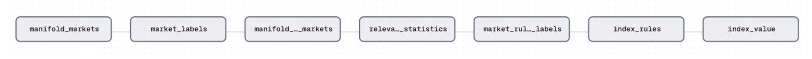

# indexcast

Indexcast is a research project exploring how **prediction markets can be aggregated into interpretable probabilistic indices** to forecast complex, uncertain events. The project was originally developed during a summer research internship at the University of Vermont and later expanded into an undergraduate honors thesis.

This repository serves as a project overview. The core implementation lives in a separate repository owned by [The Joint Lab](https://joint-lab.github.io/).

**Indexcast repository:**  
Repository is public as of Feb. 18th, 2026

[Joint Lab's indexcast](https://github.com/joint-lab/indexcast)

---

## Project Overview

The Indexcast pipeline begins by retrieving light market data (question, market type etc. not rich betting and comment history) for all prediction markets using the Manifold Markets API, yielding over 160,000 markets created since the platform’s inception. These markets span several types; we focus on binary markets, which constitute the majority of Manifold questions and are the most naturally interpretable as probabilities. With the intial binary filter, we also filter for markets that are active to ensure that all retained markets are capable of incorporating new information relevant to the index.

Using this filtered set, markets are labeled for relevance to the index question using **OpenAI’s GPT-4.1-mini**. Markets identified as relevant are then fetched in full, including complete betting histories and comment data, allowing each market to be fully reconstructed locally from the database.

For each reconstructed market, we compute summary statistics such as:
- Total traded volume  
- Recent trading volume  
- Number of distinct traders  

Using our analysis of how these metrics affect calibration, we further filter markets to retain only those with sufficient liquidity and participation for their probabilities to be informative.

Given the final set of valid markets, the goal is to aggregate their information into a single probabilistic index. Each market contributes a partial signal about the broader index question.

To formalize this aggregation, we use LLM-generated boolean rules (via GPT-4.1) that map concrete markets to index outcomes. An example rule for the index "Will there be an outbreak of H5N1 in the next 12 months?" could be "Will there be 1,000 H5N1 deaths in the US in 2026?" OR "Will there be 100,000 cases of H5N1 in the US in 2026?" Each prompted rule also has a weight for how strong the rule is and the final index value is computed as the weighted sum of the rule evaluations using the current market probabilites, assuming market independence.

## Dagster Assets Flow

lite markets -> labels -> full market retrieval -> full market statistics (number of traders, 24hr volume, total volume etc.) -> market rule eligibility labels -> index rules -> index value calculation

## Acknowledgments

This work was conducted at the University of Vermont under the mentorship of **Professor Jean-Gabriel Young**. Prediction market data was sourced from **Manifold Markets**.

